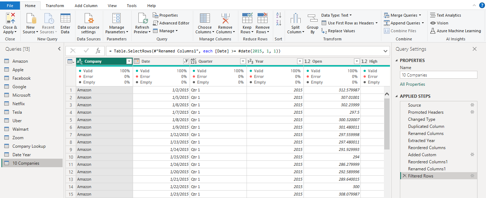
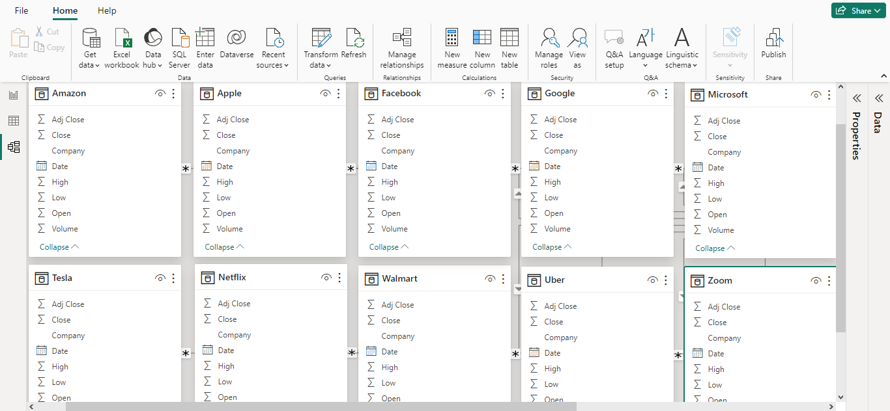
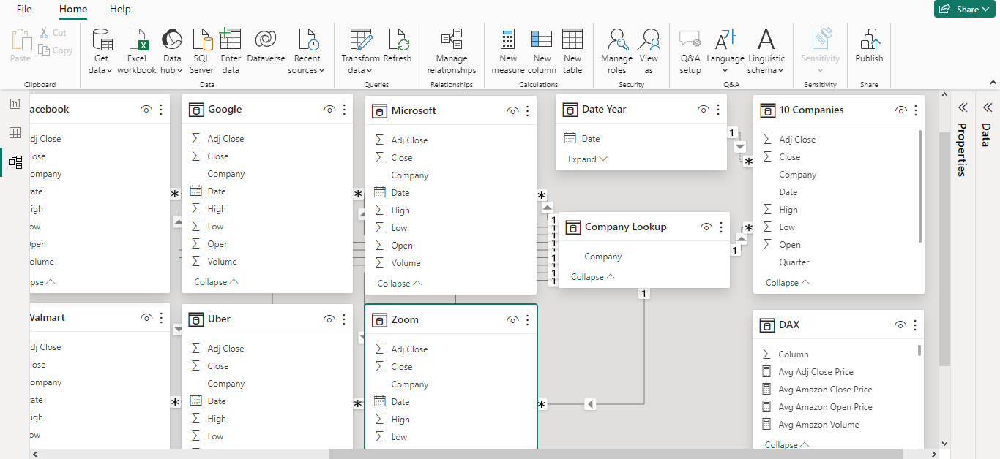
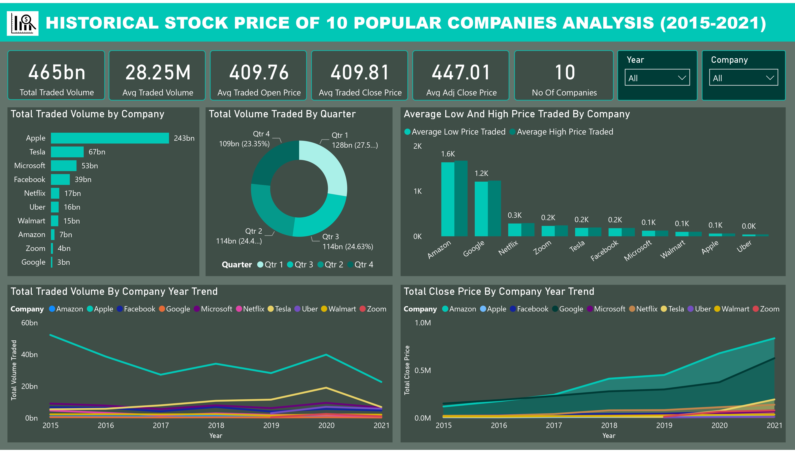
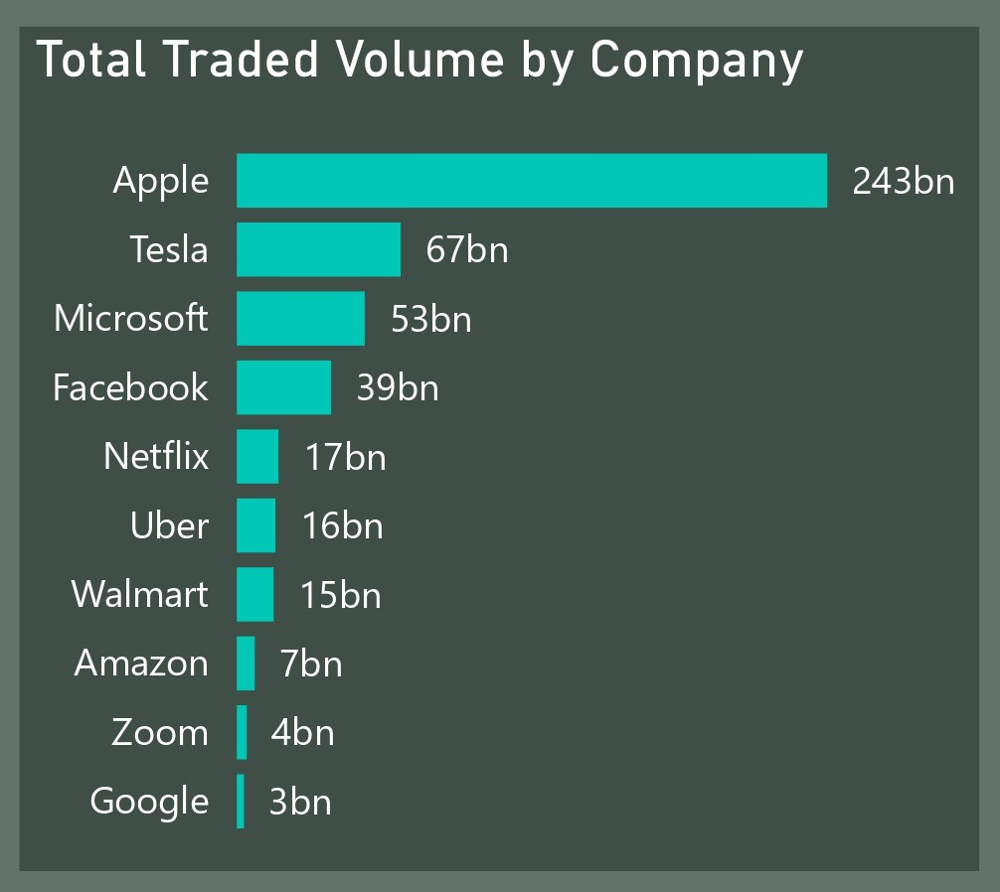
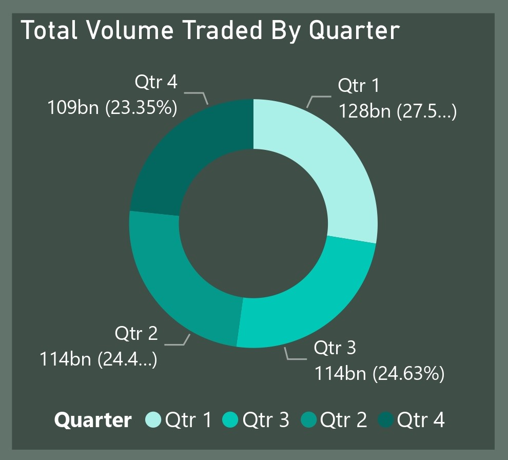
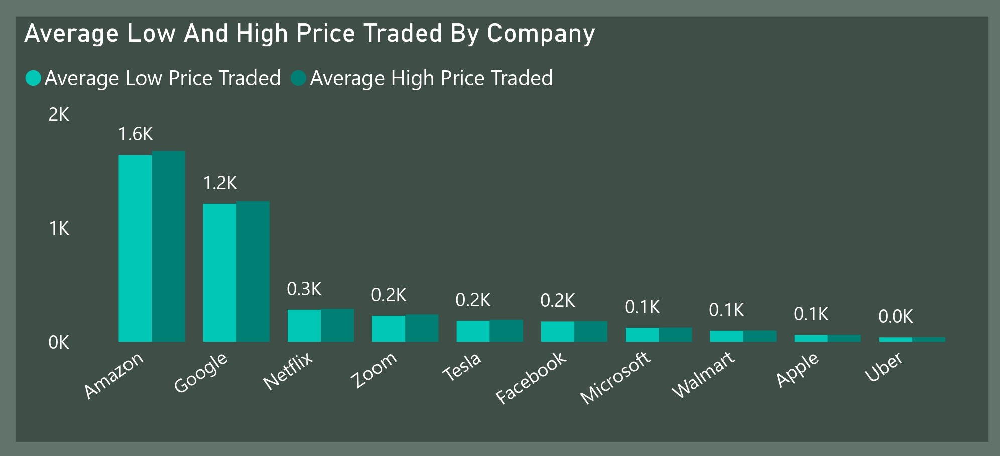

# Historical-Stock-Price-of-10-Popular-Companies-Analysis (2015-2021)

## Project Overview
### Introduction:
In the realm of finance, historical stock price analysis is indispensable for informed decision-making. This project delves into the historical stock prices of ten prominent companies globally: Apple, Amazon, Netflix, Microsoft, Google, Facebook, Tesla, Walmart, Uber, and Zoom. By scrutinizing their stock price data, the project aims to extract insights crucial for investors, analysts, and stakeholders.

### Objective:
This analysis project aims to achieve the following objectives:
- Total Traded Volume: Determine the total volume of stocks traded by each of the ten companies over the specified period.
- Total Volume Traded Quarterly: Analyze the quarterly trends in the total volume traded by the ten companies, providing insights into their trading activities throughout the year.
- Average Low and High Price: Calculate the average low and high prices of the stocks traded by each company, offering insights into the price range within which these stocks have been transacted.
- Total Volume Traded by Year: Examine the trend in the total volume of stocks traded by the ten companies on an annual basis, shedding light on their trading dynamics over time.
- Total Close Price by Year: Investigate the trend in the total closing prices of the stocks traded by the ten companies annually, providing insights into the overall performance and valuation trends.

### Expected Findings:
- Total Traded Volume: Variations in total traded volume may reflect shifts in investor sentiment, market dynamics, or company-specific events. Higher trading volumes might indicate increased investor interest or volatility in certain stocks.
- Total Volume Traded Quarterly: Quarterly analysis of trading volumes can reveal seasonal patterns or fluctuations in market activity. For instance, higher trading volumes in certain quarters may coincide with earnings releases or other significant announcements.
- Average Low and High Price: Understanding the average low and high prices can help investors gauge the price range within which a stock typically trades. Deviations from the average may signal potential buying or selling opportunities.
- Total Volume Traded by Year: Long-term trends in total traded volume may provide insights into the overall growth or decline in investor interest in the stocks of these companies. Significant changes in trading volume could be indicative of shifts in market sentiment or changes in company fundamentals.
- Total Close Price by Year: Analysis of total closing prices over time can reveal the overall performance trends of the companies' stocks. Rising or falling total close prices may indicate changes in market valuation, investor expectations, or company performance.

### About The Dataset
This dataset is made up of 10 tables for the 10 different companies historical stock price data and was supplied by [Quantum Analytics]((). These 10 tables has same columns for each and every of them.  

Each of these tables contains 7 columns. Here's an overview of the table columns along with explanations of the column names:
- Date: This column represents the date on which the stock price data was recorded or reported. Each row in the dataset corresponds to a specific date.
- Open: The "Open" price is the price at which a stock started trading when the market opened on a particular trading day. It is the first price at which the stock was traded during that day.
- High: The "High" price indicates the highest price at which the stock traded during the trading day. It represents the peak price reached by the stock during that day.
- Low: The "Low" price signifies the lowest price at which the stock traded during the trading day. It represents the lowest price reached by the stock during that day.
- Close: The "Close" price is the final price at which the stock traded when the market closed on a particular trading day. It is the last price at which the stock was traded during that day.
- Adj Close: The "Adjusted Close" price adjusts the closing price of a stock to reflect any corporate actions such as dividends, stock splits, or mergers that occurred since the stock was last traded. It provides a more accurate reflection of the stock's true value.
- Volume: The "Volume" column indicates the total number of shares of the stock that were traded during the trading day. It represents the level of trading activity for that particular stock on that day.

### Tools Used
1. Power Query Editor
    - Was used to:
        1. Extract,
        2. Transform, and
        3. Load all the datasets for this analysis.
           
2. Power BI (Was used to create reports and dashboard for this analysis)
    - The following Power BI Features were incorporated:
        1. DAX
        2. Quick Measures
        3. Page Navigation
        4. Filters
        5. Tooltips

### Data Cleaning, Transformation and Loading using the Power Query Editor:
1. I added the column __"Company"__ in each of the 10 tables to reflect the names of each company in their individual data table.
2. I Cceated a new table __"Company Lookup"__ with only one column: __"Company"__ to be able to relate with all the other tables with the "Company" key.
3. I created a new table __"10 Companies"__ housing all the data in each and every of the dataset table columns.
4. I created a table __"Date Year"__ to house the __"Date"__ seperately.
5. I added a new column __"Quarter"__ in the __"10 Companies"__ table to handle stock transactions by the 4 quaters of the year.
6. I transformed every other column type to its appropriate column type.
7. After data cleaning and tranformation was performed all the tables. The tables appeared to be clean. The quality of each column is 100% with no error or nulls. Below is a preview of some of the tables which are __Amazon__, __Facebook__, __Microsoft__, __Tesla__, and __10 Companies__ tables:

Amazon Table                                               | Facebook Table        
:---------------------------------------------------------:|:--------------------------------------------:|
                          | 

Microsoft Table                                            |Tesla Table
:---------------------------------------------------------:|:------------------------------------------------------:|
                       |  
                  
10 Companies Table                                                                 |                                
:---------------------------------------------------------------------------------:|
                                            |                                

## Data Model Design
The data required for this analysis are located in various tables. Therefore, data modelling is required. A star Schema is designed with the Company_Lookup table representing the fact table containing all the company names, and to which other dimension tables are modelled or connected to, using the __Company__ column that is common. __Company Lookup__ table has been modelled with:

- __Amazon__ table using the __"Company"__
- __Apple__ table using the __"Company"__
- __Facebook__ table using the __"Company"__
- __Google__ table using the __"Company"__
- __Microsoft__ table using the __"Company"__
- __Netflix__ table using the __"Company"__
- __Tesla__ table using the __"Company"__
- __Uber__ table using the __"Company"__
- __Walmart__ table using the __"Company"__
- __Zoom__ table using the __"Company"__
- __10 Companies__ table using the __"Company"__

The __Date Year__  table also has a relationship to the fact table through a direct relationship with the __10 Companies__ table using the key column __""Date"__ in both the __Date Year__ table and the __10 Companies__ table.
- Because our screenshot couldn't contain all the tables and their relationships, i divided the view into 2. The Model View 1 displays all the 10 Company tables linked to the fact table,
- Model View 2 displays a view of the __Company Lookup__ (fact) table, the __10 Companies__ table (dimension) table, the __Date Year__ table linked to the __10 Companys__ table, the 10 Companies tables linked to the __Company Lookup__ table and the __Data Analysis Expression__ (DAX) standing alone.  You can access the full Power BI project document [here](HISTORICAL%20STOCK%20PRICE%20OF%2010%20POPULAR%20COMPANIES.pbix).

Model View 1 (For all 10 Companies)                                                |                                
:---------------------------------------------------------------------------------:|
                                                              |           

Model View 2 (Showing the relationship between the  fact table and the dimensions tabel)      |                                
:--------------------------------------------------------------------------------------------:|
                                                                         |           

## Visualization in Power BI:
#### Report

### Project Analysis:
From the analysis, i made the following Key findings below:
- The Total Traded Volume is 465bn.
- The Total Average Traded Volume is 28.25M.
- Average Traded Open Price is 409.76.
- Average Traded Close Price is 409.81.
- Average Adjusted Close Price 447.01.
- The Total Number of Companies is 10.

- 
- **The Total Traded Volume By Company:**
- In this analysis of total traded volume by company, my analysis reveals significant disparities in trading activity across the ten popular companies. Apple leads the pack with a total traded volume of 243 billion shares, followed by Tesla with 67 billion shares and Microsoft with 53 billion shares. Facebook, Netflix, Uber, Walmart, and Amazon also exhibit substantial trading volumes, ranging from 39 billion to 15 billion shares. Zoom and Google, on the other hand, lag behind with relatively lower total traded volumes of 4 billion and 3 billion shares, respectively.

- __My Interpretation and Insights:__
  - __Investor Interest and Market Dynamics:__
      - The substantial total traded volume for companies like Apple, Tesla, and Microsoft suggests heightened investor interest and confidence in these stocks. These companies are 
        often considered market leaders in their respective industries, attracting significant attention from investors. Variations in total traded volume reflect shifts in investor 
        sentiment and market dynamics. Higher trading volumes may indicate increased investor activity driven by factors such as company performance, industry trends, economic 
        indicators, or geopolitical events. Companies with higher total traded volumes, such as Apple and Tesla, may experience greater market liquidity and price discovery, making them 
        attractive options for investors seeking active trading opportunities.
  -  __Company-Specific Events:__
      - Company-specific events such as earnings announcements, product launches, mergers, acquisitions, or regulatory developments can significantly impact trading volumes. Positive 
        news or favorable outcomes often lead to spikes in trading activity as investors react to new information. For instance, Tesla's high total traded volume could be attributed to 
        its innovative product offerings, strong brand loyalty, and disruptive influence in the electric vehicle market. Similarly, Apple's leading position may be attributed to its 
        consistent product innovation, robust financial performance, and loyal customer base.
  -  __Volatility and Risk:__
      - Higher trading volumes can indicate increased volatility in certain stocks, as larger volumes of shares are bought and sold within a given period. Volatility presents both 
        opportunities and risks for investors, as it can amplify price movements and lead to potential gains or losses. Stocks with high trading volumes may experience greater price 
        fluctuations in response to market news, leading to increased trading opportunities for investors seeking to capitalize on short-term price movements.

- 
- **Total Volume Traded By Quater:**
- In this analysis, the total volume traded by quarter provides insights into seasonal patterns and fluctuations in market activity over the period from 2015 to 2021. The data reveals distinct trends in trading volumes across the four quarters of the year, with Quarter 1 leading in terms of total volume traded, followed by Quarter 3, Quarter 2, and Quarter 4, respectively.
  - __My Interpretation and Insights:__
    - __Seasonal Patterns and Market Activity:__
        - The higher total volume traded in Quarter 1 compared to other quarters suggests a seasonal trend wherein the beginning of the year experiences increased market activity. This 
          could be attributed to various factors such as the release of annual earnings reports, strategic planning by investors, or portfolio rebalancing at the start of the year.
          Quarter 2 and Quarter 3 exhibit relatively similar total trading volumes, indicating sustained market activity throughout the middle of the year. This could coincide with 
          events such as industry conferences, economic data releases, or company-specific announcements that stimulate trading activity. Quarter 4, while experiencing a slightly lower 
          total volume traded compared to other quarters, still maintains significant market activity. This could be influenced by year-end factors such as tax considerations, holiday 
          spending trends, or end-of-year portfolio adjustments.
    - __Earnings Releases and Significant Announcements:__
        - Higher trading volumes in certain quarters may coincide with earnings releases or other significant announcements that impact investor sentiment and market dynamics. Companies 
          often release their financial results at the end of each quarter, prompting increased trading activity as investors react to the performance metrics and guidance provided.
          Additionally, major corporate events such as product launches, mergers, acquisitions, or regulatory developments can drive trading volumes during specific quarters. Positive 
          news or favorable outcomes may lead to spikes in trading activity as investors position themselves to capitalize on the opportunities presented.
    - __Investor Behavior and Market Sentiment:__
        - The fluctuation in trading volumes across quarters reflects changes in investor behavior and market sentiment throughout the year. Investors may adjust their trading 
          strategies and portfolio allocations in response to changing economic conditions, geopolitical events, or industry trends. Relating with these seasonal patterns in trading 
          activity can help investors anticipate market movements, identify trading opportunities, and manage risk effectively. It also provides valuable insights for analysts and 
          stakeholders seeking to interpret market trends and make informed decisions.

- 
- **Total Average Low And Hhigh Price Traded By Company:**
- In this analysis of the total average low and high prices traded by company, my analysis provides valuable insights into the price ranges within which stocks of different companies typically trade. Amazon leads with the highest total average low and high prices, followed by Google, Netflix, Zoom, and Tesla, among others.
  - __My Interpretation and Insights:__
    - __Understanding Price Range:__
       - The total average low and high prices traded by each company offer investors a glimpse into the typical price range within which the stock fluctuates. For example, Amazon's 
         total average low and high prices indicate that its stock typically trades within a higher price range compared to other companies like Uber or Apple.  Stocks with higher 
         average low and high prices may be perceived as more valuable or premium, while those with lower average prices may be considered more affordable or speculative.
    - __Identifying Buying or Selling Opportunities:__
       - Deviations from the average low and high prices can signal potential buying or selling opportunities for investors. For instance, if a stock's price drops significantly below 
         its average low price, it may present a buying opportunity for investors who believe the stock is undervalued and poised for a rebound. Conversely, if a stock's price surpasses 
         its average high price, it may indicate that the stock is overvalued and could be a signal for investors to consider selling or taking profits. 
    - __Risk Assessment:__
       - Knowledge of the average low and high prices traded by a company allows investors to assess the risk associated with trading that particular stock. Stocks with wider price 
         ranges may be perceived as more volatile and risky, while those with narrower price ranges may be considered more stable and predictable. 
