# Historical Stock Price Of 10-Popular Companies (2015-2021) Analysis
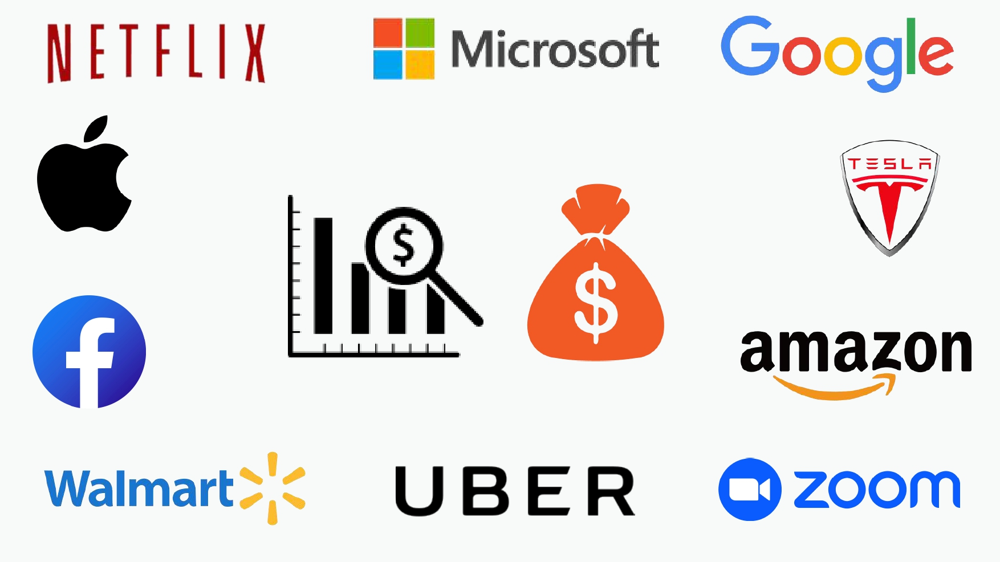
 

## Table of Contents
- [Project Overview](#project-overview)
- [About The Dataset](#about-the-dataset)
- [Tools Used](#tools-used)
- [Visualization in Power BI](#visualization-in-power-bi)
- [Project Analysis](#project-analysis)
- [Visuals in Power BI Report](#visuals-in-power-bi-report)
- [5 Strategies These 10 Companies May Need To Implement To Grow Their Stock Prices](#5-strategies-these-10-companies-may-need-to-implement-to-grow-their-stock-prices)
 

## Project Overview
### Introduction:
In the realm of finance, historical stock price analysis is indispensable for informed decision-making. This project delves into the historical stock prices of ten prominent companies globally: Apple, Amazon, Netflix, Microsoft, Google, Facebook, Tesla, Walmart, Uber, and Zoom. By scrutinizing their stock price data, the project aims to extract insights crucial for investors, analysts, and stakeholders.

### Objective:
The goals for this analysis project are as follows:
- __Total Traded Volume:__ Calculate the volume of shares for each of the ten companies traded during this period.
- __Total Volume Traded Quarterly:__ The trend analysis in relation to the total volume traded by the ten companies on a quarter-on-quarter basis gives insight into their trading activities over the year.
- __Average Low and High Price:__ It will calculate the average low and high prices that each stock of the company exchanged for, hence giving the price range in which these stocks have been traded.
- __Total Volume Traded by Year:__ This chart shows the trend of the total trading volume of stocks for each of the ten companies, outlining the trading dynamics for each over time.
- __Total Close Price by Year:__ The trend of the total closing prices of all stocks traded by the ten companies on a yearly basis will help the user see the overall trends in performance and valuation.

### Expected Findings:
- __Total Traded Volume:__ This can indicate whether total traded volumes are trending over time and therefore point to a change in investor sentiment or market dynamics, or that some company-specific event has occurred. High trading volumes could suggest precisely greater interest from investors or volatility in the stock.
- __Total Volume Traded Quarterly:__ This will pick up seasonal or other periodic fluctuations in the level of activity. This may include, for instance, spikes in trading volume in certain quarters that may correspond to the timing of earnings announcements or some other important news events.
- __Average Low and High Price:__ Knowing the average low and high prices will give one a feel for the range in which a stock commonly trades. Huge variations from this may present possible buying or selling opportunities.
- __Total Volume Traded by Year:__ Long-term trends in total volumes may indicate to the investor whether there is an interest in the stocks of these companies to investors in general. It is the tectonic shifts in trading volumes that characterize changes in sentiment or a change in how the company's fundamentals are valued by the market.
- __Total Close Price by Year:__ Long-term Analysis—The total closing prices may indicate a trend in the overall performance of the companies' stocks. Either an increasing or decreasing total close price might point to changes in the valuation by the market, investor expectations, or even in the performance of the companies themselves.
 
 

### About The Dataset
The dataset has 10 tables for the historical stock price data of 10 different companies. The data is provided by Quantum Analytics. Here is the link to the raw data folder; you can click here to find the transformed data folder. Now, for all these 10 tables, the column setup remains exactly the same.

All of the 10 tables has 7 columns each of the same column names and data types. Given below is the description of the 7 columns in the 10 tables that make up the dataset for this analysis project:
| Table                              | Field                    | Description                            |            
|:-----------------------------------|:------------------------ |:-------------------------------------- |
| Amazon.csv, Apple.csv, Facebook.csv, Google.csv, Microsoft.csv, Netflix.csv, Tesla.csv, Uber.csv, Walmart.csv, Zoom.csv| Date                     | This column shows the date of record or reporting of stock price data. Here, every row corresponds to each day in the dataset.    |
|                                    | Open                     | This is the open price of a security or the price it began selling for when the market opened on any given day of trading. It is the first quoted price for such security on that particular day.     |
|                                    | High                     | The highest price traded by that security on an official trading day. This is also referred to as the peak price that has been reached by security on that day.        |
|                                    | Low                      | The price of "Low" is the lowest that the stock has traded for during the trading day. It just depicts the lowest price touched by the stock on that particular day.         |
|                                    | Close                    | The price of "Close" is always the last price at which the stock closed when the market closes on a particular trading day. It's just the last price of the trade conducted on that day for that particular stock.        |
|                                    | Adjusted close           | "Adjusted Close" pricing refers to the close price of a stock at any given time; however, it readjusts for corporate actions that have taken place since its issue. This helps give a more distinctive, true value of the stock price.        |
|                                    | Volume                   | This column indicates the total number of shares of a given stock that traded during the trading day. Essentially, it is the level of trading activity of that particular stock for the day.        |
 
 

### Skills Utilized
1. Data Cleaning
2. Data Modelling
3. Data Visualiziation
4. Descriptive Analytics
5.Analytical and Critical Thinking
6. Problem Solving
7. Communication and Reporting
 

### Tools Used
1. Power Query Editor
    - Was used to:
        1. Extract,
        2. Cleaned
        3. Transform  all the datasets for this analysis.
           
2. Power BI (Was used to create reports and dashboard for this analysis)
    - The following Power BI Features were incorporated:
        1. DAX
        2. Quick Measures
        3. Filters
        4. Tooltips
 

### Data Cleaning, Transformation and Loading using the Power Query Editor:
1. Added the column __"Company"__ in each of the 10 tables to reflect the names of each company in their individual data table.
2. Created a new table __"Company Lookup"__ with only one column: __"Company"__ to be able to relate with all the other tables with the "Company" key.
3. Created a new table __"10 Companies"__ housing all the data in each and every of the dataset table columns.
4. Created a table __"Date Year"__ to house the __"Date"__ seperately.
5. Added a new column __"Quarter"__ in the __"10 Companies"__ table to handle stock transactions by the 4 quaters of the year.
6. Transformed every other column type to its appropriate column type.
7. After data cleaning and tranformation were performed on all the tables. The tables appeared to be clean. The quality of each column became 100% with no error or nulls.

- Below is a preview of some of the tables which are __Amazon__, __Facebook__, __Microsoft__, __Tesla__, and __10 Companies__ tables:

Amazon Table                                               | Facebook Table        
:---------------------------------------------------------:|:--------------------------------------------:|
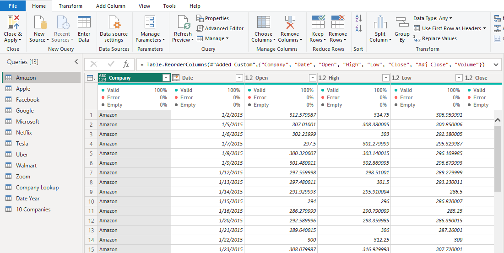                          | 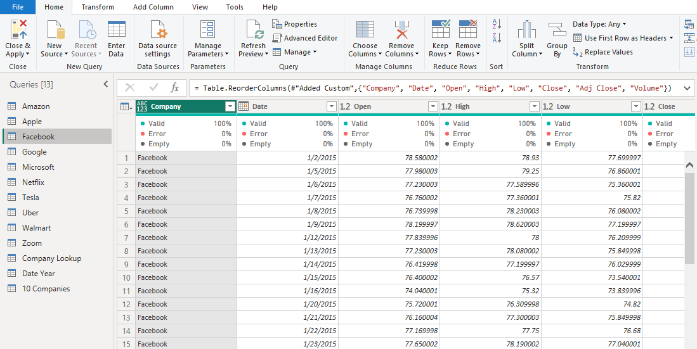

Microsoft Table                                            |Tesla Table
:---------------------------------------------------------:|:------------------------------------------------------:|
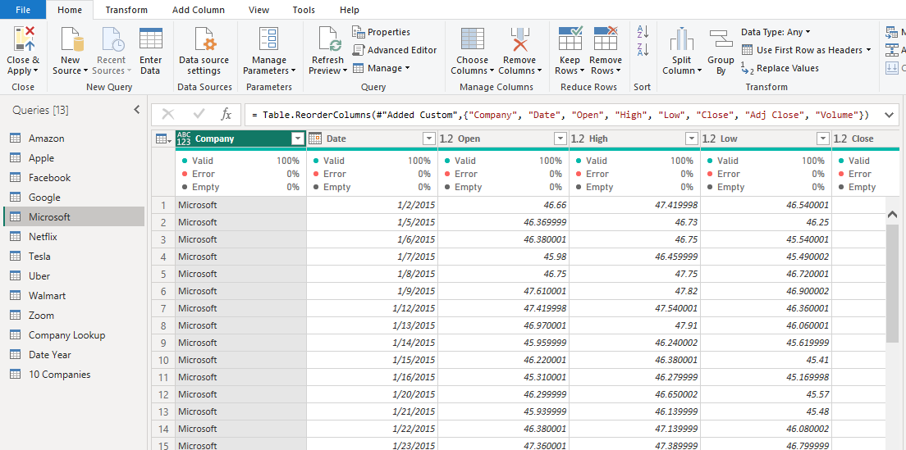                       |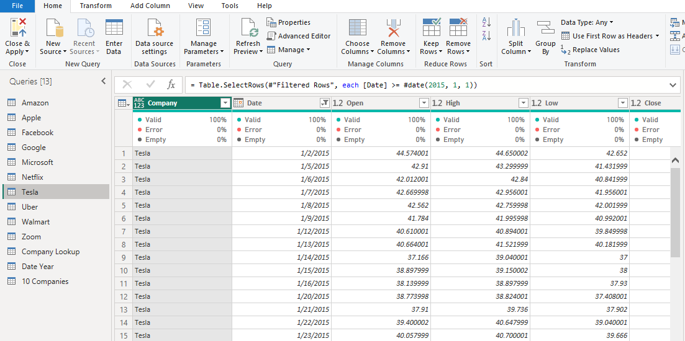  
                  
10 Companies Table                                                                 |                                
:---------------------------------------------------------------------------------:|
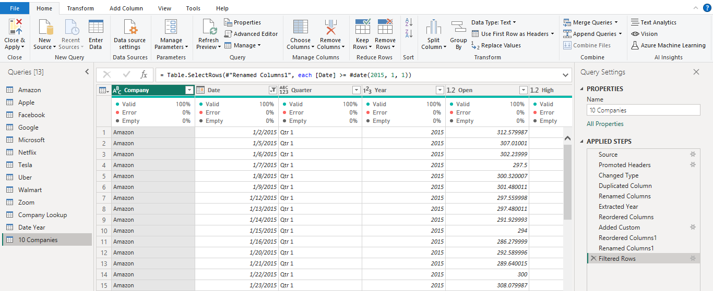                                            |                                
 
 

## Data Model Design
The data required for this analysis are located in various tables. Therefore, data modelling was required. A star Schema was designed with the Company_Lookup table representing the __fact table__ containing all the company names, and to which other __dimension tables__ were modelled or connected, using the __Company__ column that is common. The __Company Lookup__ table has been modelled with:

- __Amazon__ table using the __"Company"__
- __Apple__ table using the __"Company"__
- __Facebook__ table using the __"Company"__
- __Google__ table using the __"Company"__
- __Microsoft__ table using the __"Company"__
- __Netflix__ table using the __"Company"__
- __Tesla__ table using the __"Company"__
- __Uber__ table using the __"Company"__
- __Walmart__ table using the __"Company"__
- __Zoom__ table using the __"Company"__
- __10 Companies__ table using the __"Company"__

The __Date Year__  table also has a relationship with the fact table through a direct relationship with the __10 Companies__ table using the key column __"Date"__ in both the __Date Year__ table and the __10 Companies__ table.
- Because our screenshot couldn't contain all the tables and their relationships, I divided the view into 2. The Model View 1 displays all the 10 Company tables linked to the fact table,
- Model View 2 displays a view of the __Company Lookup__ (fact) table, the __10 Companies__ table (dimension) table, the __Date Year__ table linked to the __10 Company's__ table, the 10 Companies tables linked to the __Company Lookup__ table and the __Data Analysis Expression__ (DAX) standing alone.  You can access the full Power BI project document [here](HISTORICAL%20STOCK%20PRICE%20OF%2010%20POPULAR%20COMPANIES.pbix).
 

Model View 1 (For all 10 Companies)                                                |                                
:---------------------------------------------------------------------------------:|
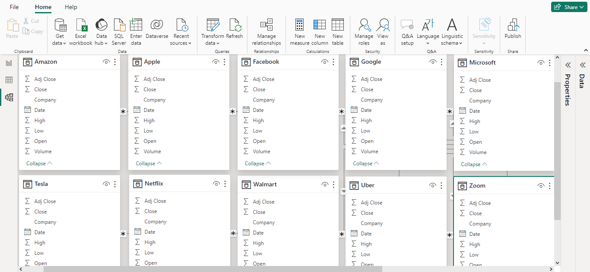                                                              |           
 

Model View 2 (Showing the relationship between the fact table and the dimensions tabel)      |                                
:--------------------------------------------------------------------------------------------:|
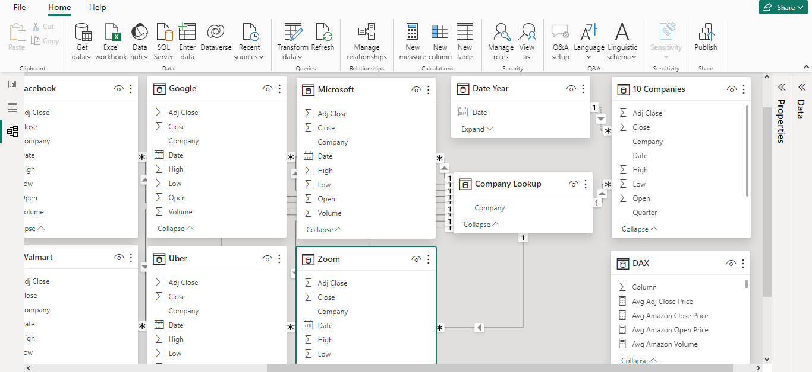                                                                         |           
 
 

## Visualization in Power BI:
#### Report

 
 

### Project Analysis:
From the analysis, i made the following Key findings below:
- The Total Traded Volume is __465bn.__
- The Total Average Traded Volume is __28.25M.__
- Average Traded Open Price is __409.76.__
- Average Traded Close Price is __409.81.__
- Average Adjusted Close Price __447.01.__
- The Total Number of Companies is __10.__
 
 

- 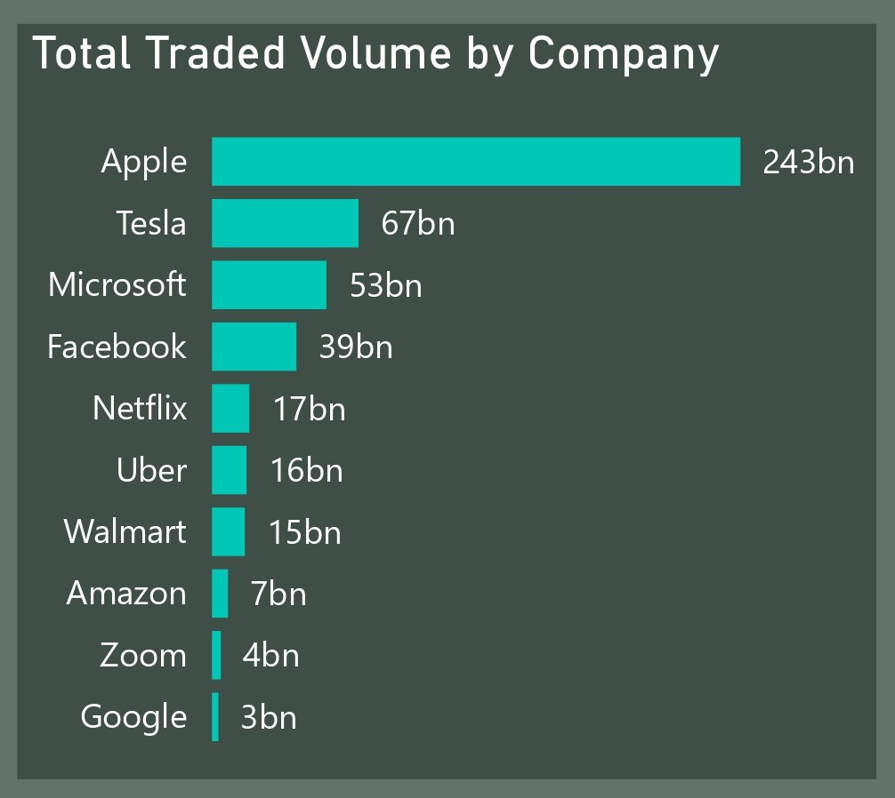

- **The Total Traded Volume By Company:**
My analysis OF thE total traded volume by a company brings out overwhelming disparities in trading activity among the ten popular companies. The conclusion shows that Apple leads in terms of volume traded, having 243 billion shares traded, followed by Tesla and Microsoft with 67 billion and 53 billion, respectively. Other companies, like Facebook, Netflix, Uber, Walmart, and Amazon, trade at volumes running from 39 to 15 billion shares in that order. Zoom and Google are completely out of this pace, with quite considerably lower total traded volumes of 4 billion and 3 billion shares, correspondingly

- __My Interpretation and Insights:__
   - **Investor Interest and Market Dynamics:**
      - The substantial total traded volume for companies like Apple, Tesla, and Microsoft suggests heightened investor interest and confidence in these stocks. These companies are often considered market leaders in their respective industries, attracting significant attention from investors.
      - Variations in total traded volume reflect shifts in investor sentiment and market dynamics. Higher trading volumes may indicate increased investor activity driven by factors such as company performance, industry trends, economic indicators, or geopolitical events.
      - Companies with higher total traded volumes, such as Apple and Tesla, may experience greater market liquidity and price discovery, making them attractive options for investors seeking active trading opportunities.
    - **Company-Specific Events:**
      - Company-specific events such as earnings announcements, product launches, mergers, acquisitions, or regulatory developments can significantly impact trading volumes. Positive news or favorable outcomes often lead to spikes in trading activity as investors react to new information.
      -  For instance, Tesla's high total traded volume could be attributed to its innovative product offerings, strong brand loyalty, and disruptive influence in the electric vehicle market. Similarly, Apple's leading position may be attributed to its consistent product innovation, robust financial performance, and loyal customer base.
    - **Volatility and Risk:**
      - Higher trading volumes can indicate increased volatility in certain stocks, as larger volumes of shares are bought and sold within a given period.
      - Volatility presents both opportunities and risks for investors, as it can amplify price movements and lead to potential gains or losses.
      - Stocks with high trading volumes may experience greater price fluctuations in response to market news, leading to increased trading opportunities for investors seeking to capitalize on short-term
 
 

- 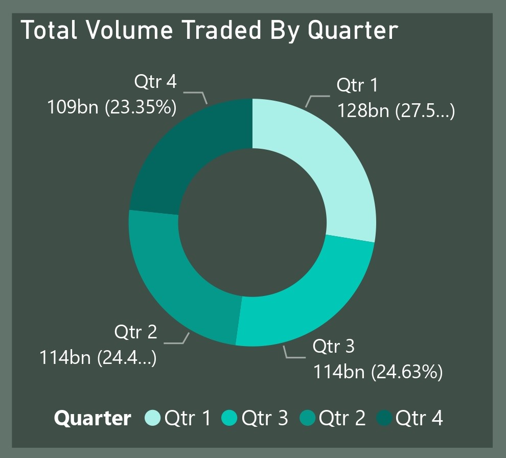

- **Total Volume Traded By Quater:**
- In this case, the total volume that is traded quarterly will go a long way in bringing out the seasonal trends or fluctuations in market activity from the year 2015 to 2021. Since the data clearly reflects trends of the total trading volumes through the four quarters of a year, the first one, therefore, has the highest total volume traded, followed by Quarter 3, Quarter 2, and then finally Quarter 4.
  
- __My Interpretation and Insights:__
  -  __Seasonal Patterns and Market Activity:__
     - The trading volume in different quarters of the year can provide insights into seasonal patterns and market activity:
        - Quarter 1: Higher total volume traded compared to other quarters suggests increased market activity at the beginning of the year. Possible reasons for this trend include:
          - Release of annual earnings reports
          - Strategic planning by investors
          - Portfolio rebalancing at the start of the year
        - Quarter 2 and Quarter 3: These two quarters exhibit relatively similar total trading volumes, indicating sustained market activity throughout the middle of the year. Possible factors contributing to this consistency are:
          - Industry conferences
          - Economic data releases
          - Company-specific announcements that stimulate trading activity
        - Quarter 4: While experiencing a slightly lower total volume traded compared to other quarters, it still maintains significant market activity. This could be influenced by year-end factors such as:
          - Tax considerations
          - Holiday spending trends
          - End-of-year portfolio adjustments

  - __Earnings Releases and Significant Announcements:__
    - The timing of earnings releases and other significant announcements can also impact trading volumes:
        - Earnings Releases: Companies often release their financial results at the end of each quarter, prompting increased trading activity as investors react to the performance metrics and guidance provided.
        - Major Corporate Events: Significant events such as product launches, mergers, acquisitions, or regulatory developments can also drive trading volumes during specific quarters. Positive news or favorable outcomes may lead to spikes in trading activity as investors position themselves to capitalize on the opportunities presented.
Monitoring these events and understanding their potential impact on investor sentiment can be crucial for making informed investment decisions.

  - __Investor Behavior and Market Sentiment:__
    - The fluctuation in trading volumes across quarters reflects changes in investor behavior and market sentiment throughout the year. Factors that can influence this behavior include:
       - Economic Conditions: Investors may adjust their trading strategies and portfolio allocations based on shifts in the overall economy.
       - Geopolitical Events: Political developments at both domestic and international levels can have a significant impact on investor sentiment.
       - Industry Trends: Specific sectors or industries may experience periods of growth or decline, influencing investor preferences.
 
 

- 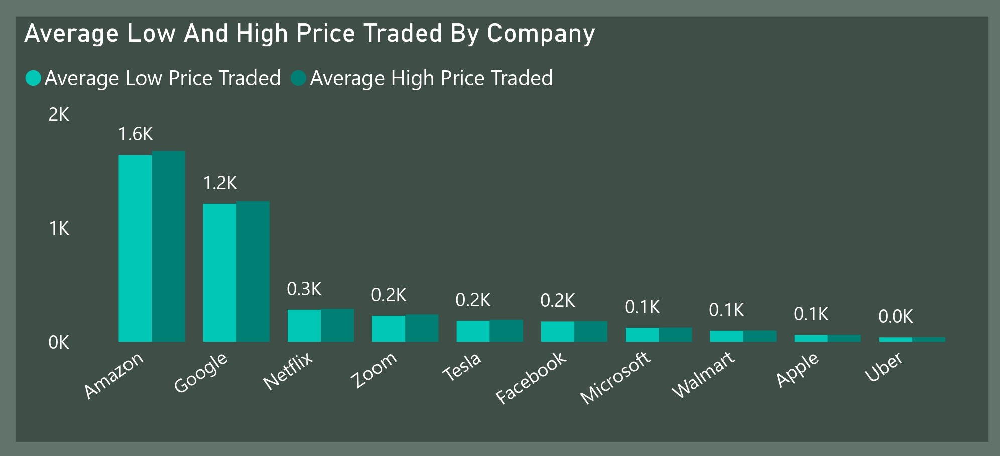

- **Total Average Low And Hhigh Price Traded By Company:**
  - __Understanding Price Range:__
    - The total average low and high prices traded by each company offer investors a glimpse into the typical price range within which the stock fluctuates. For example, Amazon's 
    total average low and high prices indicate that its stock typically trades within a higher price range compared to other companies like Uber or Apple. Stocks with higher 
    average low and high prices may be perceived as more valuable or premium, while those with lower average prices may be considered more affordable or speculative.
  - __Identifying Buying or Selling Opportunities:__
    - Deviations from the average low and high prices can signal potential buying or selling opportunities for investors. For instance, if a stock's price drops significantly below 
    its average low price, it may present a buying opportunity for investors who believe the stock is undervalued and poised for a rebound. Conversely, if a stock's price surpasses 
    its average high price, it may indicate that the stock is overvalued and could be a signal for investors to consider selling or taking profits. 
  - __Risk Assessment:__
    - Knowledge of the average low and high prices traded by a company allows investors to assess the risk associated with trading that particular stock. Stocks with wider price 
    ranges may be perceived as more volatile and risky, while those with narrower price ranges may be considered more stable and predictable.
 
 

- 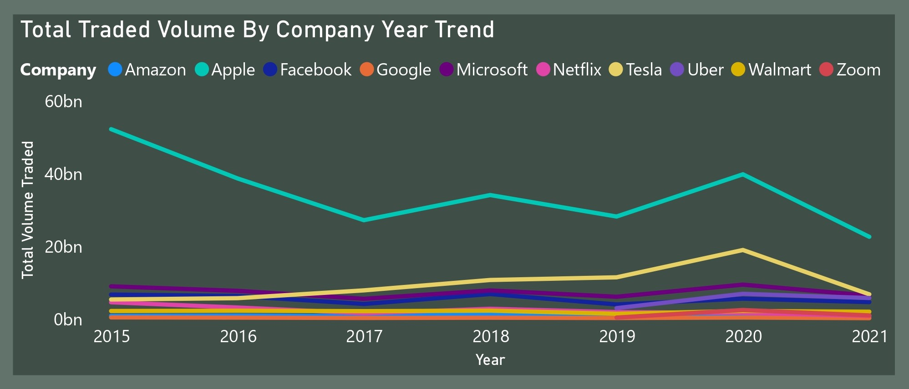

- **Total Traded Volume By Company Year Trend:**
  - __Overall Growth or Decline in Trading Volume:__ Across most companies, there is a general trend of increasing trading volume over the years, indicating growing investor interest in these stocks. For example, Amazon, Apple, Microsoft, and Tesla have experienced consistent growth in trading volume from 2015 to 2021. This upward trend in trading volume suggests a positive outlook towards these companies by investors over the long term. It may be attributed to factors such as company performance, industry trends, market dynamics, and macroeconomic conditions.
  - __Company-Specific Trends:__ Some companies exhibit fluctuations or irregularities in trading volume over the years. For instance, Uber and Zoom, being relatively newer companies, show significant increases in trading volume from 2019 onwards, reflecting heightened investor interest following their initial public offerings (IPOs). Netflix shows a slight decline in trading volume from 2015 to 2021, which could be attributed to factors such as increased competition in the streaming industry or changes in consumer preferences. However, the overall trend remains relatively stable.
  - __Indicators of Market Sentiment and Company Fundamentals:__ Significant changes in trading volume can be indicative of shifts in market sentiment or changes in company fundamentals. For example, sudden spikes in trading volume may coincide with major news events, earnings releases, product launches, or regulatory announcements that impact investor perceptions. Investors often interpret changes in trading volume as signals of market activity and adjust their investment strategies accordingly. Higher trading volumes may reflect increased investor confidence or speculation, while lower volumes may signal caution or lack of interest.
  - __Long-Term Investment Trends:__ The long-term trends in total traded volume provide valuable insights for investors seeking to understand the broader investment landscape and identify potential opportunities or risks. Companies with consistent growth in trading volume over the years may be viewed favorably by investors as stable investment options with strong growth prospects. Conversely, companies experiencing declining trading volume may face challenges or uncertainties that warrant closer

 
 

- 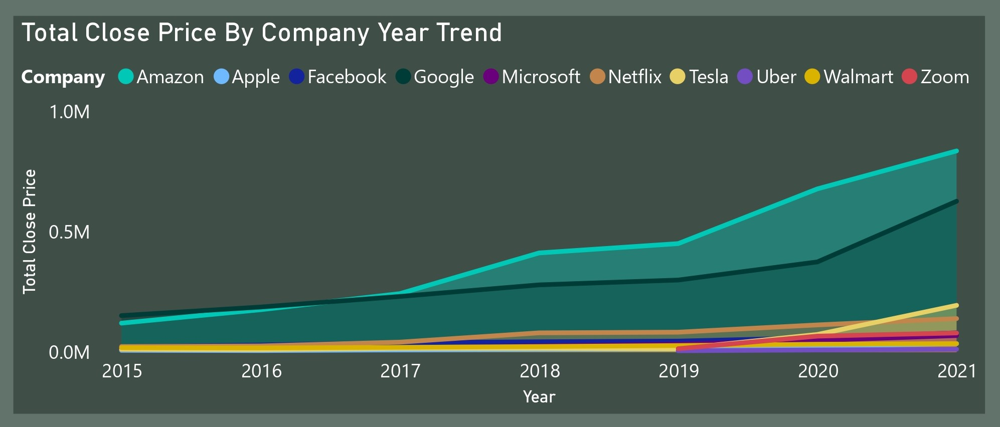

- **Total Close Price By Company Year Trend:**
- This multi-line chart presents the total close price of each company's stock across the years 2015 to 2021. In this analysis, I aim to provide insights into the performance trends of the companies' stocks over time and how changes in total close prices may reflect shifts in market valuation, investor expectations, or company performance.
  - __My Interpretation and Insights:__
    - __Overall Performance Trends:__ The data shows different trends in the total close prices of each company's stock over the seven-year period. Some companies consistently have higher close prices, while others have more ups and downs. For example, Amazon, Apple, Facebook, Google, Microsoft, Netflix, Tesla, Walmart, Uber, and Zoom all have unique patterns in their total close prices over time because each company operates in its own way and faces different market conditions.
    - __Changes in Market Valuation and Investor Expectations:__ Increasing total close prices over time may mean that the market values the company more and investors are optimistic about its future. It suggests that investors are willing to pay more for the company's stock because they expect it to grow and make more money. On the other hand, decreasing total close prices may indicate that the market values the company less and investors are worried about its performance.
    - __Impact of Company Performance:__ Changes in total close prices can also show how well or poorly a company is doing. This includes things like changes in how much money it makes, its profits, its share of the market compared to competitors, or its plans for growth. Good news like strong financial results or successful new products can make stock prices go up, while bad news can make them go down. For example, Tesla's huge increase in total close price from 2015 to 2021 may be because it has been growing quickly, coming up with new ideas for technology, and getting more customers than other electric car companies.
    - __Investor Behavior and Market Dynamics:__ The way investors act and what's happening in the market also affect changes in total close prices over time. Things like how the economy is doing overall, trends in different industries, new rules from the government, or big events around the world can make investors feel more positive or negative and cause stock prices to move. Looking closely at what's really behind changes in total close prices helps investors make smart choices and change their investment plans to take advantage of good things or protect themselves from bad things.
 
 

## Visuals in Power BI Report:
You can view and interact with this dashboard report on Historical Stock Price of 10 Popular Companies (2015-2021) Analysis [here](https://app.powerbi.com/view?r=eyJrIjoiM2M4OGY4OWQtMzlmNS00OTljLTgyNGUtYTU2NmVmZjFjN2IyIiwidCI6IjdlYzI5NjU5LTNjZjItNGYzZi1hYmIzLWE3MjJlZGY3ZmYyZCJ9).
 
 
 

## 5 Strategies These 10 Companies May Need To Implement To Grow Their Stock Prices
- __Continuous Innovation:__ These 10 Companies may need to invest in research and development (R&D) to innovate and develop new products, services, or technologies that address emerging market needs and trends. Continuous innovation can enhance competitive advantage and drive revenue growth.
- __Market Expansion and Diversification:__ They may also need to explore opportunities for geographic expansion into new markets or diversification into adjacent industries or sectors. Expanding the customer base and revenue streams can mitigate risk and unlock new growth opportunities.
- __Digital Transformation:__ They would need to embrace digital transformation initiatives to leverage technology for enhanced operational efficiency, customer engagement, and data-driven decision-making. Investing in digital infrastructure and online platforms can drive growth in the digital economy.
- __Strong Financial Performance:__ It would be necessary they maintain strong financial performance by achieving revenue growth, profitability, and efficient capital allocation.
- __Transparency and Stakeholder Engagement:__ They may need to foster transparency, open communication, and stakeholder engagement with investors, employees, customers, and the community. Providing regular updates on company performance, and strategic initiatives can build trust and credibility, ultimately driving shareholder value.
 
 

## Thank You For Following Through!

