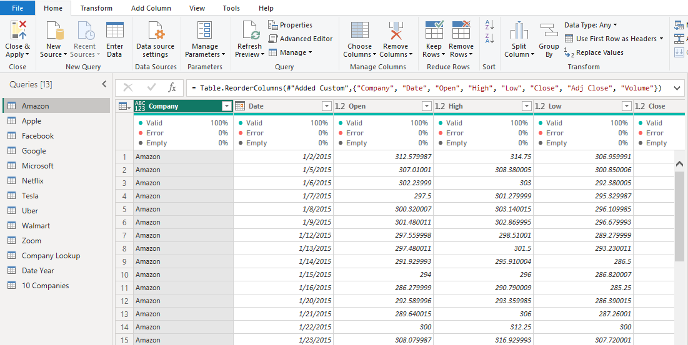
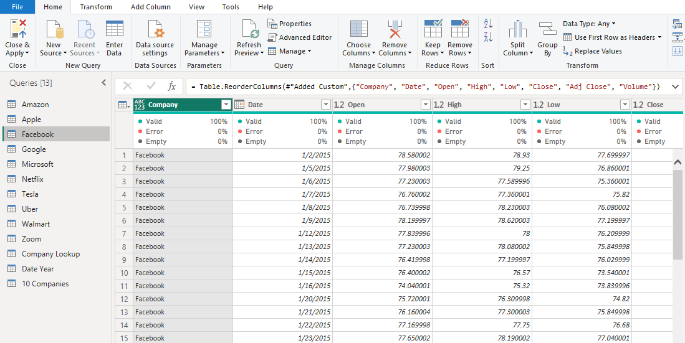
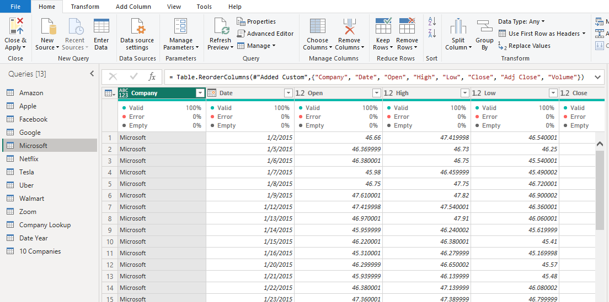
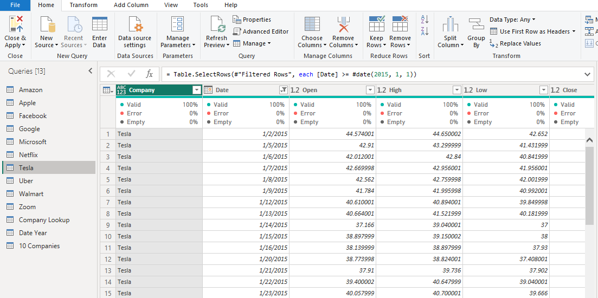

# Historical-Stock-Price-of-10-Popular-Companies-Analysis (2015-2021)

## Project Overview
### Introduction:
In the realm of finance, historical stock price analysis is indispensable for informed decision-making. This project delves into the historical stock prices of ten prominent companies globally: Apple, Amazon, Netflix, Microsoft, Google, Facebook, Tesla, Walmart, Uber, and Zoom. By scrutinizing their stock price data, the project aims to extract insights crucial for investors, analysts, and stakeholders.

### Objective:
This analysis project aims to achieve the following objectives:
- Total Traded Volume: Determine the total volume of stocks traded by each of the ten companies over the specified period.
- Total Volume Traded Quarterly: Analyze the quarterly trends in the total volume traded by the ten companies, providing insights into their trading activities throughout the year.
- Average Low and High Price: Calculate the average low and high prices of the stocks traded by each company, offering insights into the price range within which these stocks have been transacted.
- Total Volume Traded by Year: Examine the trend in the total volume of stocks traded by the ten companies on an annual basis, shedding light on their trading dynamics over time.
- Total Close Price by Year: Investigate the trend in the total closing prices of the stocks traded by the ten companies annually, providing insights into the overall performance and valuation trends.

### Expected Findings:
- Total Traded Volume: Variations in total traded volume may reflect shifts in investor sentiment, market dynamics, or company-specific events. Higher trading volumes might indicate increased investor interest or volatility in certain stocks.
- Total Volume Traded Quarterly: Quarterly analysis of trading volumes can reveal seasonal patterns or fluctuations in market activity. For instance, higher trading volumes in certain quarters may coincide with earnings releases or other significant announcements.
- Average Low and High Price: Understanding the average low and high prices can help investors gauge the price range within which a stock typically trades. Deviations from the average may signal potential buying or selling opportunities.
- Total Volume Traded by Year: Long-term trends in total traded volume may provide insights into the overall growth or decline in investor interest in the stocks of these companies. Significant changes in trading volume could be indicative of shifts in market sentiment or changes in company fundamentals.
- Total Close Price by Year: Analysis of total closing prices over time can reveal the overall performance trends of the companies' stocks. Rising or falling total close prices may indicate changes in market valuation, investor expectations, or company performance.

### About The Dataset
This dataset is made up of 10 tables for the 10 different companies historical stock price data and was supplied by [Quantum Analytics]((). These 10 tables has same columns for each and every of them.  

Each of these tables contains 7 columns. Here's an overview of the table columns along with explanations of the column names:
- Date: This column represents the date on which the stock price data was recorded or reported. Each row in the dataset corresponds to a specific date.
- Open: The "Open" price is the price at which a stock started trading when the market opened on a particular trading day. It is the first price at which the stock was traded during that day.
- High: The "High" price indicates the highest price at which the stock traded during the trading day. It represents the peak price reached by the stock during that day.
- Low: The "Low" price signifies the lowest price at which the stock traded during the trading day. It represents the lowest price reached by the stock during that day.
- Close: The "Close" price is the final price at which the stock traded when the market closed on a particular trading day. It is the last price at which the stock was traded during that day.
- Adj Close: The "Adjusted Close" price adjusts the closing price of a stock to reflect any corporate actions such as dividends, stock splits, or mergers that occurred since the stock was last traded. It provides a more accurate reflection of the stock's true value.
- Volume: The "Volume" column indicates the total number of shares of the stock that were traded during the trading day. It represents the level of trading activity for that particular stock on that day.

### Tools Used
1. Power Query Editor
    - Was used to:
        1. Extract,
        2. Transform, and
        3. Load all the datasets for this analysis.
           
2. Power BI (Was used to create reports and dashboard for this analysis)
    - The following Power BI Features were incorporated:
        1. DAX
        2. Quick Measures
        3. Page Navigation
        4. Filters
        5. Tooltips

### Data Cleaning, Transformation and Loading using the Power Query Editor:
1. I added the column __"Company"__ in each of the 10 tables to reflect the names of each company in their individual data table.
2. I Cceated a new table __"Company Lookup"__ with only one column: __"Company"__ to be able to relate with all the other tables with the "Company" key.
3. I created a new table __"10 Companies"__ housing all the data in each and every of the dataset table columns.
4. I created a table __"Date Year"__ to house the __"Date"__ seperately.
5. I added a new column __"Quarter"__ in the __"10 Companies"__ table to handle stock transactions by the 4 quaters of the year.
6. I transformed every other column type to its appropriate column type.
7. After data cleaning and tranformation was performed all the tables. The tables appeared to be clean. The quality of each column is 100% with no error or nulls. Below is a preview of some of the tables which are the __Amazon__, __Facebook__, __Tesla__, and the __10 Companies__ tables:

Amazon Table                                               | Facebook Table        
:---------------------------------------------------------:|:--------------------------------------------:|
                          | 

Microsoft Table                                            |Tesla Table
:---------------------------------------------------------:|:------------------------------------------------------:|
                       |  
                  
|10 Companies Table                                                                                               | 
|:---------------------------------------------------------------------------------------------------------------:|
|                                                                           |

